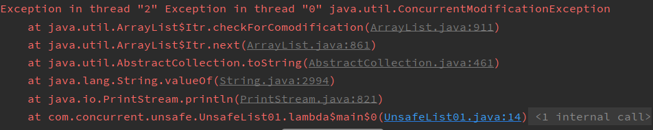
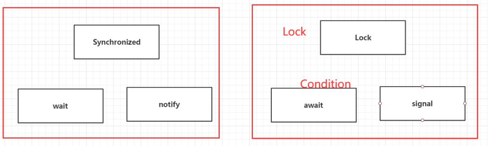
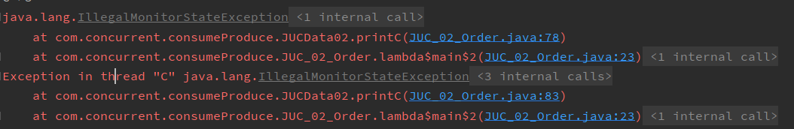

*书山有路勤为径，学海无涯苦作舟*


参考

* http://mishadoff.com/blog/java-magic-part-4-sun-dot-misc-dot-unsafe/


# 并发编程

程序：程序是指令和数据的有序集合，静态的概念

进程：执行程序的一次过程，动态概念。是操作系统分配资源的单位。例子，视频播放（图像、声音、字幕）

线程：一个进程可以包含若干个线程；是CPU调度和执行的单位。


## 进程

操作系统会分配给进程内存、文件资源。进程的切换会保存进程表。


## 线程

进程是线程的容器，操作系统会分配给线程的只有CPU的资源，线程的切换是轻量级的，只有寄存器数据需要保存起来。


### ThreadLocal

线程共享进程内存，ThreadLocal就是通过抽象数据结构来实现的线程本地对象，其他线程无法访问和修改。


```java
ThreadLocal<Integer> threadLocal = new ThreadLocal<>();
threadLocal.get();
threadLocal.set(1);
threadLocal.remove(); // 将当前线程绑定的当前对象移除
```


```java
public class Test05_ThreadLocal {
    static ThreadLocal<Person> threadLocal = new ThreadLocal<>();
    public static void main(String[] args) {
        new Thread(()->{
            threadLocal.set(new Person("z2"));
            try {
                TimeUnit.SECONDS.sleep(1);
            } catch (InterruptedException e) {
                e.printStackTrace();
            }
            System.out.println(Thread.currentThread().getName() + " -> " + threadLocal.get());
        }, "T1").start();
        new Thread(()->{
            try {
                TimeUnit.SECONDS.sleep(2);
            } catch (InterruptedException e) {
                e.printStackTrace();
            }
            System.out.println(Thread.currentThread().getName() + " -> " + threadLocal.get());
        }, "T2").start();
    }
}

class Person {
    private String name;
    public Person(String name) {
        this.name = name;
    }
}

/** 执行结果：
T1 -> cn.xincan.test.refTypeAndThreadLocal.Person@62660012
T2 -> null
*/
```


> ThreadLocal 源码

```java
public void set(T value) {
    Thread t = Thread.currentThread();
    ThreadLocalMap map = getMap(t);
    if (map != null)
        map.set(this, value);
    else
        createMap(t, value);
}
```

得到：

* 每个线程都有自己的 ThreadLocalMap 
* ThreadLocalMap 存放当前的 threadLocal 对象（this）作为 key
* 一个线程可以使用多个 ThreadLocal 对象


```java
static class ThreadLocalMap {

        /**
         * The entries in this hash map extend WeakReference, using
         * its main ref field as the key (which is always a
         * ThreadLocal object).  Note that null keys (i.e. entry.get()
         * == null) mean that the key is no longer referenced, so the
         * entry can be expunged from table.  Such entries are referred to
         * as "stale entries" in the code that follows.
         */
        static class Entry extends WeakReference<ThreadLocal<?>> {
            /** The value associated with this ThreadLocal. */
            Object value;

            Entry(ThreadLocal<?> k, Object v) {
                super(k);
                value = v;
            }
        }
}
```

Entry 的key 是弱引用。


> 应用场景

基于线程本地的全局变量，延申出来的使用场景：

1. 在多线程的场景下，用 threadLocal 可以线程的全局变量。可以去掉原来方法之间的参数传递

2. Spring 事务中，要保证数据库使用的 connection 同一个。Spring 里做法是把 connection 放到threadLocal 里的，后续的数据库连接都从 ThreadLocal 取而不是从连接池里取。


> 内存泄漏

ThreadLocal 可能会造成内存泄漏，我们在使用完后，务必要调用 threadLocal.remove()


执行流程

* ThreadLocalMap 的 key 采用弱引用，GC 处理完后，key 的值 null；
* ThreadLocalMap 会在 set、get、remove 中调用`expungeStaleEntry`来将所有失效的`Entity`移除


在以往我们使用完对象以后等着`GC`清理，但是对于`ThreadLocal`来说，即使我们使用结束，也会因为线程本身存在该对象的引用，处于对象可达状态，垃圾回收器无法回收。这个时候当`ThreadLocal`太多的时候就会出现内存泄漏的问题。

而我们将`ThreadLocal`对象的引用作为弱引用，那么就很好的解决了这个问题。当我们自己使用完`ThreadLocal`以后，**「当`GC`的时候就会将我们创建的强引用直接干掉，而这个时候我们完全可以将线程`Map`中的引用干掉，于是使用了弱引用，这个时候大家应该懂了为啥不使用软引用了吧」**

**「还有一个问题：为什么会引发内存泄漏呢？」**

了解`Map`结构的兄弟们应该清楚，内部实际就一个节点数组，对于`ThreadLocalMap`而言，内部是一个`Entity`，它将`Key`作为弱引用，`Value`还是强引用。如果我们在使用完`ThreadLocal`以后，没有对`Entity`进行移除，会引发内存泄漏问题。

`ThreadLocalMap`提供了一个方法`expungeStaleEntry`方法用来排除无效的`Entity`（`Key`为空的实体）


有一些要复用的线程，如线程池中的核心线程可能不会被销毁。ThreadLocal 要及时清理不用的值。从 ThreadLocal 源码看，set 是放到 每个线程独立的 ThreadLocalMap 中。map 的key 是 弱引用保证了及时清理的机制。


### ThreadLocalMap

解决哈希冲突的方式是线性探测法：如果当前数组位有值，则判断下一个数组位是否有值，如果有值继续向下寻找，直到一个为空的数组位


我们可以看到一个现象：在`set`,`get`,`remove`的时候都调用了`expungeStaleEntry`来将所有失效的`Entity`移除


使用完后，threadLocal.remove()  ，避免 value 导致的内存泄漏


## 线程池


# 同步器


## 同步

### 执行同步

多个参与线程并发执行，在某一点汇合（join），执行后续操作


### 数据同步

多份数据保持数据一致


## Synchronized

synchronized 是最早的同步实现，一切从这里开始

```java
synchronized(obj) {
    // 临界区
}
```

转换成伪码

```java
enterLock;
// 临界区
releaseLock;
```


synchronized 需要满足的能力

* 实现锁/解锁
* 实现自旋锁到休眠的升级逻辑
* API设计：每个对象都可以上锁
* 线程在竞争不到资源时休眠
* 释放资源时唤醒线程


### 线程休眠

访问临界区代码，在未获取到锁时，线程要进入休眠

| 休眠机制                                  | 描述             | 特点                                                         |
| ----------------------------------------- | ---------------- | ------------------------------------------------------------ |
| 休眠少量CPU周期（自旋锁）                 | 以慢速执行指令   | CPU 较少分配给该线程资源<br />CPU 能耗少，发热少，低温状态CPU性能更好 |
| 定时休眠（类似Thread.sleep）              | 休眠固定时间0    | CPU 停止分配线程资源；<br />时间所有浪费，用户体验不好       |
| ==信号休眠、信号唤醒（类似wait/notify）== | 等待其他线程唤醒 | 性能和体验都更好                                             |

> 休眠方案一

先尝试自旋（默认10次），再尝试信号休眠、唤醒


object.wait

object.notify


### 线程唤醒


**JVM 知道哪些线程在哪些对象上休眠？**


### 对象锁

 


### 底层实现

由一对指令括起来的代码 monitorenter， monitorexit 


### 双重检查锁（DCL）

```java
if() {
    synchronized(this) {
        if() return ;
        ...               
    }
}
```

外层的if判断可以避免加锁竞争效率提高；

内层if判断可能线程已经执行完毕；


> 应用场景


## Lock


### ReentrantLock

可重入锁

可重入性

> 怎么理解可重入的概念？

简单定义:"可以正确重复使用"，有两个关键：1，可以重复使用；2，并能正确使用。意味着在多次执行的时候能得到正确的值，并不受其他调用的影响。

官方定义：若一个程序或子程序可以“在任意时刻被中断然后操作系统调度执行另外一段代码，这段代码又调用了该子程序不会出错”，则称其为可重入（reentrant或re-entrant）的。即当该子程序正在运行时，执行线程可以再次进入并执行它，仍然获得符合设计时预期的结果。==与多线程并发执行的线程安全不同，可重入强调对单个线程执行时重新进入同一个子程序仍然是安全的==。

> 这里也有一段比较好的英文阐释：
> A computer program or routine is described as reentrant if it can be safely called again before its previous invocation has been completed (i.e it can be safely executed concurrently)

可重入函数主要用于多任务环境中，一个可重入的函数简单来说就是可以被中断的函数，也就是说，可以在这个函数执行的任何时刻中断它，转入OS调度下去执行另外一段代码，而返回控制时不会出现什么错误；而不可重入的函数由于使用了一些==系统资源，比如全局变量区，中断向量表等==，所以它如果被中断的话，可能会出现问题，这类函数是不能运行在多任务环境下的。

产生背景

可重入概念是在单线程操作系统的时代提出的。一个子程序的重入，可能由于自身原因，如执行了jmp或者call，类似于子程序的递归调用；或者由于操作系统的中断响应。UNIX系统的signal的处理，即子程序被中断处理程序或者signal处理程序调用。所以，可重入也可称作“异步信号安全”。这里的异步是指信号中断可发生在任意时刻。 重入的子程序，按照==后进先出==线性序依次执行。


可重入锁

可重入锁的定义：当线程请求一个由其他线程持有的==对象锁==时，该线程会阻塞，而当线程请求由自己持有的对象锁是，如果该锁是可重入的，请求就会成功，否则阻塞。

|          | Synchronized | ReentrantLock        |
| -------- | ------------ | -------------------- |
| 锁类型   | 非公平锁     | 默认非公平锁，可配置 |
| 实现方式 | JVM实现      | JDK 实现             |
|          |              |                      |


```java
// 验证 ReentrantLock 是可重入锁
public class ReentrantTest01 {
    private final Lock lock = new ReentrantLock();
    int value = 0;

    public static void main(String[] args) throws InterruptedException {
        ReentrantTest01 test = new ReentrantTest01();
        Thread t1 = new Thread(()->{
            test.add();
        });
        t1.start();

        // 等待t1线程执行完毕
        t1.join();

        System.out.println(test.value);
    }

    public void add() {
        lock.lock();
        try {
            value = 1 + get();
        } finally {
            lock.unlock();
        }
    }

    public int get() {
        lock.lock();
        try {
            return value;
        } finally {
            lock.unlock();
        }
    }
}
```


```java
// 验证 Synchronized 是可重入锁
public class ReentrantTest02 {
    private final Object object = new Object();
    int value = 0;

    public static void main(String[] args) throws InterruptedException {
        ReentrantTest02 test = new ReentrantTest02();
        Thread t1 = new Thread(()->{
            test.add();
        });
        t1.start();
        // 等待t1线程执行完毕
        t1.join();
        System.out.println(test.value);
    }

    public void add() {
        synchronized(object) {
            value = 1 + get();
        }
    }

    public int get() {
        synchronized(object) {
            return value;
        }
    }
}
```


```java
// 实现自定义不可重入锁
public class CustomLock {
    private boolean isLock = false;

    public synchronized void lock() throws InterruptedException {
        while (isLock) {
            wait();
        }
        isLock = true;
    }

    public synchronized void unlock() {
        isLock = false;
        notify();
    }
}
```


```java
// 实现自定义可重入锁
public class CustomReentrantLock {
    private boolean isLock = false;
    private Thread lockThread = null;
    private int lockedCount = 0;
    public synchronized void lock() throws InterruptedException {
        //System.out.println("isLock=" + isLock + " lockThreadId=" + lockThreadId + " currentId=" +currentId  );
        while (isLock && !Objects.equals(lockThread, Thread.currentThread())) {
            wait();
        }
        isLock = true;
        lockThread = Thread.currentThread();
        lockedCount++;
    }

    public synchronized void unlock() {
        if (isLock && Objects.equals(lockThread, Thread.currentThread())) {
            lockedCount--;
            if (lockedCount == 0) {
                isLock = false;
                lockThread = null;
                notify();
            }
        }
    }
}
```


### ReenterantReadWriteLock


> Synchronized 和 Lock 区别

1. Synchronized 内置的Java关键字， Lock 是一个Java类
2. Synchronized 无法判断获取锁的状态，Lock 可以判断是否获取到了锁（TODO 应用场景）
3. Synchronized 会自动释放锁，lock 必须要手动释放锁！如果不释放锁，死锁（类似开车中的自动挡和手动挡，问开车比赛中为什么都是手动挡，车手要尽可能把赛车的性能发挥到极致，这就需要对车有更精准的控制）
4. Synchronized 线程 1（获得锁，阻塞，获得锁可能又阻塞了，TODO 场景）、线程2（等待，傻傻的等，暗含效率低）；Lock锁就不一定会等待下去（lock. tryLock 不会傻傻等， TODO tryLock 时机）；
5. Synchronized 可重入锁，不可以中断的，非公平；Lock ，可重入锁，可以 判断锁，非公平（可以
    自己设置）；
6. Synchronized 适合锁少量的代码同步问题（TODO 最佳实践吗？），Lock 适合锁大量的同步代码！


> 锁是什么，如何判断锁的是谁！ 

synchronized 若修饰的是方法，那么锁的是该类的实例对象，若修饰的是 static 方法，那么锁就是 Class 对象（模板）


## CAS


### ABA

参考：https://developer.aliyun.com/article/744324?spm=a2c6h.12873639.0.0.1bf75749dEe9BJ


ABA 描述（略）


### volatile 关键字


ABA 在一些特殊场景下，会存在问题，举一个堆栈操作的例子：


并发1（上）：读取栈顶的元素为“A1”


并发2：进行了2次出栈


并发3：又进行了1次出栈


并发1（下）：实施CAS乐观锁，发现栈顶还是“A1”，于是修改为A2


此时会出现系统错误，因为此“A1”非彼“A1” 


再举个例子，有一个链表 head->A->B—>C，线程1要把A都移除掉，线程2发现有B就再B前加一个A。线程1、2 就会频繁加减元素。


**ABA问题可以怎么优化？**

* AtomicMarkableReference（boolean表示版本）
* AtomicStampedReference（int表示版本）

实现原理是增加版本，让 CAS 从整体看，除了看值本身，还看版本是否正确！


## Atmoic类

底层是 CAS 原子指令实现


## 工具对比

|      | Synchronized | Lock | CAS  | Atmoic |
| ---- | ------------ | ---- | ---- | ------ |
| 性能 | 低           | 中   | 高   | 高     |
|      |              |      |      |        |
|      |              |      |      |        |


# AQS

同步器开发框架

**AQS**：AbstractQueuedSynchronizer


用来给程序员自定义同步器


	


| 休眠+唤醒                      | 是否加锁                 | 备注                   |
| ------------------------------ | ------------------------ | ---------------------- |
| Object.wait/notify             | 需要加锁，因为非原子操作 | 需要锁，否则会竞争条件 |
| Lock.newCondition.await/signal | 需要加锁，因为非原子操作 | 需要锁，否则会竞争条件 |
| LockSupport.park/unpark        | 无须加锁，因为底层方法   |                        |


synchronized的缺点

* 不能让用户实现更底层的数据结构


AQS，Java中的抽象类都是为了简化开发，防止程序犯一些低级的错误。


AQS 提供的能力

* tryLock  - 超时
* 接收线程中断
* tryAcquire 非阻塞版获取锁
* release 释放锁
* acquire 获取锁
* condition 条件变量（操作系统提供，基于整数的生产者/消费者模型）
* int state > CAS（替代 unsafe 的 cas）
* 队列


----------------


# 锁

|          | 描述                                                         | 实现原理                                          | 是否公平                                     |
| -------- | ------------------------------------------------------------ | ------------------------------------------------- | -------------------------------------------- |
| 自旋锁   | 线程自旋一定次数，如10次，若没有竞争到锁，<br />则会升级重量级锁。<br />但高并发场景下，线程可能都会执行完自旋次数，<br />性能浪费 | java 实现自旋，CAS 尝试                           | 公平                                         |
| 轻量级锁 | 线程先逐个插入EntrySet队列尾部，仅头部的线程自旋，竞争失败，则升级到重量级锁。 | java实现EntrySet                                  | 公平                                         |
| 重量级锁 |                                                              | 操作系统实现WaitSet，操作系统可见的休眠线程范围。 | 公平                                         |
| 偏向锁   | 看 Object的偏向锁位置是否存在owner线程，<br />如果竞争成功，这里会插对优先执行 | java实现的部分，更加轻量                          | 非公平：当前线程插队，避免进程切换，效率更高 |


# JUC

java.util.concurrent


## 不安全集合


> ArrayLIst 是不安全的

```java
public static void main(String[] args) {
    List<String> list = new ArrayList<>();
    for (int i = 0; i < 10; i++) {
        new Thread(()->{
            list.add(UUID.randomUUID().toString().substring(0, 5));
            System.out.println(list);
        }, String.valueOf(i)).start();
    }
}
```



java.util.ConcurrentModificationException 并发修改异常


解决方案：

* java.util.concurrent.CopyOnWriteArrayList (JUC 方案)
* Collections.synchronizedList(new ArrayList<>())
* new Vector<>() —— JDK1.0就有了，源码实现是用 synchronized 关键字


## CopyOnWrite

读写分离的思想


> 为什么 copyOnWriteArrayList 要比 vector 好

* 前者的源码是通过 lock/unlock 和 复制来实现的，后者是  synchronized，前者的性能更好。（TODO 为什么lock就是好）


> Map 也不安全


> 为什么说工作中不用HashMap


> ConcurrentHashMap

TODO 看源码 jdk 文档


> 创建多线程的几种方式

* Thread
* Runnable
* Callable


## Callable

```java
public static void main(String[] args) throws ExecutionException, InterruptedException {
    FutureTask futureTask = new FutureTask<>(()->{
        return "everything";
    });

    Thread thread = new Thread(futureTask);
    thread.start();

    System.out.println(futureTask.get());
}

/** 执行结果：
everything
*/
```


与 Runnable 相比

* 有返回值，是泛型
* **可以抛出异常**
* 方法不同，runnable 是 run， callable 是 call

```java
new Thread(new Runnable()).start(); // Thread 构造参数只能接收 Runnable 
new Thread(new FutureTask<V>()).start(); // FutureTask 是Runnable 的实现类
new Thread(new FutureTask<V>( Callable )).start(); // Callable 无法直接关联 Thread，需要适配类 - FutureTask

// 获取返回值
FutureTask futureTask = new MyThreadByCallable(); // 拿到引用
new Thread(futureTask, "A").start();
futureTask.get(); // 这个 get 方法可能会产生阻塞，把它放到最后，或者使用异步通信来处理
```

==注意==

Callable 的返回值

* 可能需要等待，会阻塞
* 有缓存，多次调用 call 方法，只执行一次


> 应用场景


## FutureTask

JDK 1.5

特点：

* 有返回值，但是是阻塞的


## CompletableFuture

JDK 1.8

对 FutureTask 的改进

* 有返回值，且是异步的（不阻塞）

> 应用场景


## 停止线程

先看线程执行的任务类型


> 计算型 cpu 密集型

没有 wait、await，没有等待，没有阻塞操作。

线程执行代码中增加一个标志位（volatile），线程定时判断标志位，是要继续、中断、还是回滚。

思路：通过标志位 + DCL 来结束。


>IO密集型

有等待，有阻塞操作

例子：从网卡读取数据，线程处理 wait 中，程序无法在线程wait中增加标志位代码来检查。

思路：interrupt


---------------


取消线程的方案：

* 做好同步
* 若要支持多次取消，做好幂等（无状态）


> 回滚线程


## 常用辅助类

### CountDownLatch 

减法计数器

原理：

countDownLatch.countDown(); // 数量-1

countDownLatch.await(); // 等待计数器归零，然后再向下执行

所以组合起来使用就是，每次有线程调用 countDown() 数量-1，假设计数器变为0，countDownLatch.await() 就会被唤醒，继续执行！  


### CyclicBarrier

加法计数器


## Semaphore

信号量：限流，保持有序

例子：抢车位，6辆车抢3个停车位。


**原理：**
semaphore.acquire() 获得，假设如果已经满了，等待，等待被释放为止！  

semaphore.release(); 释放，会将当前的信号量释放 + 1，然后唤醒等待的线程！

+1 -1 非常像生产者消费者模型；也隐含了线程间的通信。

**作用**： 多个共享资源互斥的使用！并发限流，控制最大的线程数！  


# 综合应用


## 生产者/消费者

这个模型非常普遍，如发红包抢红包


抽象为  读/计算/写 模型


线程交替执行

线程之间的通信问题，必然提到生产者和消费者问题

例子：

A B 操作同一个变量 num = 0 ，先是 A num +1，再是 B num -1。要保证有序交替。

多线程开发中涉及到共享资源的，必须加锁

> 实现一：Synchronized 版（老版），使用 wait（等待唤醒） 和 notify（通知唤醒） 实现，这三个是一组的。

wait、notify 是 Object 类，所以每个Java实例都有

```java
/**
 * 线程交替
 * 线程 A: num +1
 * 线程 B: num -1
 */
public class ConsumeAndProduceTest {
    public static void main(String[] args) {
        Num num = new Num();
        new Thread(()->{
            for (int i = 0; i < 20; i++) {
                try {
                    num.incr();
                } catch (InterruptedException e) {
                    e.printStackTrace();
                }
            }
        }, "A").start();

        new Thread(()->{
            for (int i = 0; i < 20; i++) {
                try {
                    num.decr();
                } catch (InterruptedException e) {
                    e.printStackTrace();
                }
            }
        }, "B").start();
    }
}

class Num {
    private int val = 0;

    public synchronized void incr() throws InterruptedException {
        if (val != 0) {
            this.wait();
        }
        this.val++;
        System.out.println(Thread.currentThread().getName() + "=>" + this.val);
        this.notify();
    }

    public synchronized void decr() throws InterruptedException {
        if (val == 0) {
            this.wait();
        }
        this.val--;
        System.out.println(Thread.currentThread().getName() + "=>" + this.val);
        this.notify();
    }
}
```

> 当由两个线程，变为4个线程时，上面的代码会出现问题，如何解决？

问题原因

* notify 没有分组，可能同是 +1 的线程先拿到锁
* 线程业务操作时，没有再次判断条件

上面就是**虚假唤醒**

用 while 替代 if


> JUC 版（新版）生产者消费者

新老版有个对应关系




```java
// 数字 资源类
public class JUCData {
    private int number = 0;

    Lock lock = new ReentrantLock();
    Condition condition = lock.newCondition();
    public void increment() throws InterruptedException {
        lock.lock();
        try {
            while (number != 0) {
                condition.await();
            }
            number++;
            System.out.println(Thread.currentThread().getName() + "=>" + number);
            condition.signalAll();
        } catch (Exception e) {
            e.printStackTrace();
        } finally {
            lock.unlock();
        }
    }

    public void decrement() throws InterruptedException {
        lock.lock();
        try {
            while (number == 0) {
                condition.await();
            }
            number--;
            System.out.println(Thread.currentThread().getName() + "=>" + number);
            condition.signalAll();
        } catch (Exception e) {
            e.printStackTrace();
        } finally {
            lock.unlock();
        }
    }
}
```

实现了 synchronized 版本，一样的效果，但诞生新技术的意义是？

> Condition

Condition 的诞生，解决了线程的有序问题

Condition 精准的通知和唤醒线程




报错原因是忘记加锁了，没有加锁，直接调用 Condition 或 lock.unlock

```java
public class JUC_02_Order {
    public static void main(String[] args) {
        JUCData02 data = new JUCData02();
        new Thread(() -> {
            for (int i = 0; i < 10; i++) {
                data.printA();
            }
        }, "A").start();

        new Thread(() -> {
            for (int i = 0; i < 10; i++) {
                data.printB();
            }
        }, "B").start();
        new Thread(() -> {
            for (int i = 0; i < 10; i++) {
                data.printC();
            }
        }, "C").start();
    }
}


// 数字 资源类
class JUCData02 {
    private Lock lock = new ReentrantLock();
    private Condition condition1 = lock.newCondition();
    private Condition condition2 = lock.newCondition();
    private Condition condition3 = lock.newCondition();

    private int number = 1; // 1A 2B 3C

    public void printA() {
        lock.lock();
        try {
            while (number % 3 != 1) {
                condition1.await();
            }
            System.out.println(Thread.currentThread().getName() + "=>" + number);
            number++;
            condition2.signal();
        } catch (Exception e) {
            e.printStackTrace();
        } finally {
            lock.unlock();
        }
    }
    public void printB() {
        lock.lock();
        try {
            while (number % 3 != 2) {
                condition2.await();
            }
            System.out.println(Thread.currentThread().getName() + "=>" + number);
            number++;
            condition3.signal();
        } catch (Exception e) {
            e.printStackTrace();
        } finally {
            lock.unlock();
        }
    }
    public void printC() {
        lock.lock();
        try {
            while (number % 3 != 0) {
                condition3.await();
            }
            System.out.println(Thread.currentThread().getName() + "=>" + number);
            number++;
            condition1.signal();
        } catch (Exception e) {
            e.printStackTrace();
        } finally {
            lock.unlock();
        }
    }
}
```


## 实现分布式事务

扼要技术点

* volatile —— 线程可见性
* 双重检查锁
* completableFuture —— 异步且返回线程的执行结果

```
有这样的一个任务T
T由N个子任务构成，每个子任务完成的时长不同
若其中有一个子任务失败
所有任务结束，T 任务失败
请写程序模拟这个过程

要求Fail Fast，结束越快越好
```

```java
public class Test01_DistributedTransaction {
    public static void main(String[] args) throws ExecutionException, InterruptedException, IOException {
        MyTask task1 = new MyTask("task1", 5, true);
        MyTask task2 = new MyTask("task2", 1, false);
        MyTask task3 = new MyTask("task3", 3, true);

        // 异步获取
 CompletableFuture.supplyAsync(task1::call).thenAccept(Test01_DistributedTransaction::callback);      CompletableFuture.supplyAsync(task2::call).thenAccept(Test01_DistributedTransaction::callback);
 CompletableFuture.supplyAsync(task3::call).thenAccept(Test01_DistributedTransaction::callback);
        // 让线程执有时间执行完
        System.in.read();
    }

    private static void callback(Boolean result) {
        if (false == result) {
            System.out.println("错误发生");
        }
    }

    private static class MyTask {
        private String name;
        private int seconds;
        private boolean ret;

        public MyTask(String name, int seconds, boolean ret) {
            this.name = name;
            this.seconds = seconds;
            this.ret = ret;
        }

        public Boolean call() {
            try {
                TimeUnit.SECONDS.sleep(seconds);
            } catch (InterruptedException e) {
                e.printStackTrace();
            }
            System.out.println(name + " task callback");
            return ret;
        }
    }
}
```


