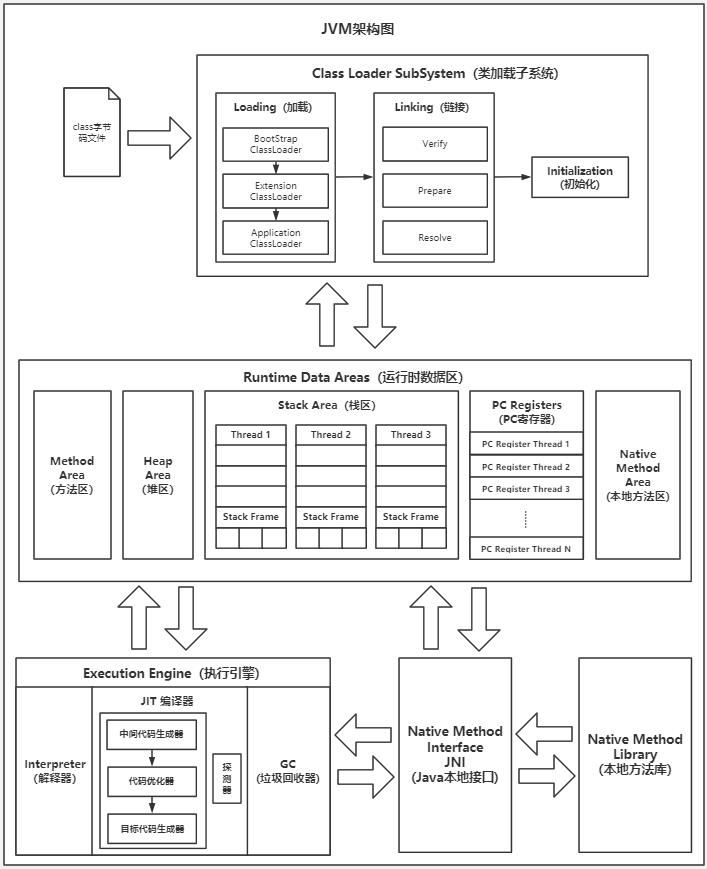
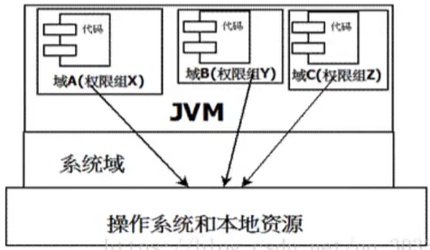
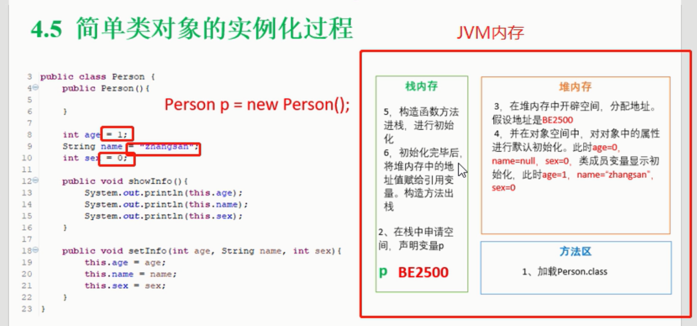
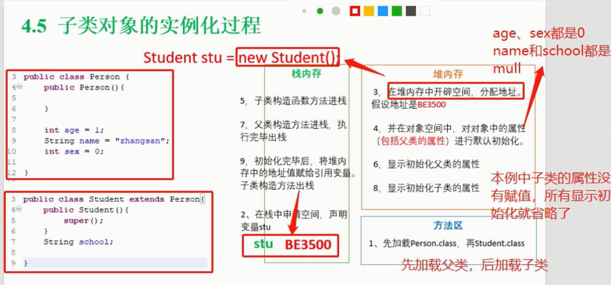
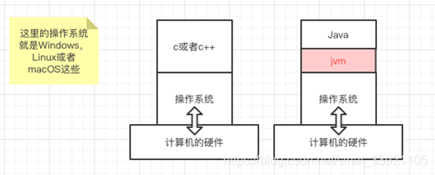

*书山有路勤为径，学海无涯苦作舟*


# Class 文件


class 文件包含

* byte code
* meta data


查看class 文件

*  `javap -verbose  xxx.class` 

*  vscode 安装插件 hexdump，以16位进制查看


## ByteCode

JVM的实现是基于栈的结构的。因为栈是最适合用来==实现function互相调用==的。

字节码里面有很多iconst、aload、istore的东西，这些东西被称作Opcode，也就是一些基于栈的操作指令。

指令名字其实是一个助记词，真实的Opcode是一个占用两个字节的数字


# 堆栈


堆和栈的区别


|              | 栈                                                 | 堆（内存）                       |
| ------------ | -------------------------------------------------- | -------------------------------- |
| ==本质区别== | 配合程序（线程）执行使用的，存储了执行时的临时数据 |                                  |
| 数据结构     | 先进后出                                           | 没有固定的结构规则，是一堆”东西“ |
| 内存地址     | 高位到地位                                         | 地位到高位                       |
| 内存释放     | 栈指针指向位置及其之后，都认为是”可用空间“         | GC                               |


# 认识JVM

JVM 是 Java 虚拟机

虚拟机：==软件**模拟**的计算机系统==（包含完整硬件功能、上面的程序运行在完全隔离环境中）

JVM 用软件**模拟J**ava字节码的指令集（模拟了CPU的行为），是Java程序的运行环境（Java 应用需要跑在 JVM 上）

JVM 在运行时就是操作系统的一个进程实例，为每个Java进程提供了一个 Java 运行平台（JVM屏蔽了操作系统与硬件的差别）

对 Java 进程而言，JVM 是一台”真实“的机器


提供功能

* 通过 ClassLoader 寻找和装载 class文件
* 解释字节码成为==指令==并执行，提供 class 文件的运行环境
* 进行运行期间的内存分配和垃圾回收
* 提供与硬件交互的平台


*认识JVM*

	


# JVM内存布局

	


程序寄存器

* 管理当前程序执行的位置


虚拟机栈：

* 执行到方法时，将方法打包成一个栈帧，投放到虚拟机栈里，当方式执行完，会进行出栈。
    * 每个方法的调用和完成，对应着虚拟机栈中的入栈和出栈的过程


Java堆

* Java虚拟机所管理的内存中最大的一块。
* Java堆是被所有线程共享的一块内存区域，对象实例在这里分配内存。
* 是垃圾收集器（GC）管理的主要区域


方法区（JDK 1.7 以前）：

* 存储已被虚拟机加载的
    * 类信息：类的继承关系、实现哪些接口、泛型
    * 常量、
    * 静态变量、
    * 即时编译器编译后的代码等数据，
    * （JDK1.6）运行时常量池（Runtime Constant Pool）是方法区的一部分。


直接内存（元空间 JDK 1.8）：

* 直接内存（Direct Memory）并不是虚拟机运行时数据区的一部分，也不是Java虚拟机规范中定义的内存区域


JDK 内存模型变化

1.6：

* 运行时常量池是在方法区中

1.7

* 运行时常量池放在堆中

1.8

* 方法区被移出运行时数据区，放到本地内存中（元空间 metaspace）


从对象的角度

* 栈：配合执行执行使用的
* 堆：存放对象实例的信息
* 方法区：类的信息、常量池、编译后的程序


从线程的角度

* 栈：每个线程有自己独立的栈空间
* pc ：


# JVM参数

```
- 标准参数
-X 扩展参数（非标准）
-XX 开发调试用（如打印详细日志）
```


# ClassLoader

## 双亲委派机制

1. 加载器收到类加载请求
2. 将请求向上==委托给父类加载器==去完成，一直往上委托，直到启动类加载器
3. 启动类加载器检查是否能加载当前这个类，能加载就结束，使用当前的加载器；否则抛出异常，通知子加载器进行加载
4. 重复步骤 3

如果都找不到，则会抛出 Class Not Found 


打破双亲委派机制，重写 loader.loadClass 方法，比如Spring用到Mybatis，这个时候，就用Mybatis的Loader去加载类。注意，并不是用自己的parent，所以需要打破双亲委派模型。


## OSGI

	

*OSGI 模型*

在OSG模型中，一个Bunde类似我们说的一个项目（Java的一个工具、库等等）。==每个Bundle有自己的ClassLoader==，当它们用到其他Bundle的类时，比如Spring用到Mybatis，这个时候，就用Mybatis的Loader去加载类。注意，并不是用自己的parent，所以需要打破双亲委派模型。


## 实现ClassLoader

自定义ClassLoader ，需要继承ClassLoader，实现 findClass 方法


# GC

https://zhuanlan.zhihu.com/p/383179950

常用算法


GC 处理内存的所有问题，申请、分配、回收、故障异常。

GC 是Java执行引擎的一部分，掌握程序的运行的控制权

GC管理着==所有==的对象

## 为什么要GC？


## 什么是STW？

Stop The World

类比：妈妈在打扫，小孩在弄乱房间，妈妈忙不过来时，触发 STW ，让程序停止。


**STW的实现原理**

线程在执行的时候，会轮询STW标记，检查自己是否要停止


## 性能指标

### 吞吐量

吞吐量（Throughput）是衡量==性能指标==的通用指标

GC吞吐量定义：程序工作时间占比 —— GC 没有占用的 CPU 时间

==注意：==吞吐量不代表响应性


**提供吞吐量的方法**

* 开发参数 -XX: GCTimeRation=99，是指吞吐量占 99%，GC只占1%
* 扩展参数 -Xmx4G 给更大的内存 Heap，减少 GC 的工作频率
* 优化 GC 算法
* 多线程 GC ？


> 多线程GC 能否提高吞吐量？

看情况

在单核利用率足够的情况下，1一个线程需要100s，10个线程的时间要大于 10s。时间变快了，但是吞吐量并没有提升。

* 10个线程可能分布在一个核心
* 线程需要创建、汇合
* 根据 阿姆达定律，任务的可并发比例不是百分百的


目标：越高的吞吐量会节省硬件的成本。


### 延迟

Latency（pause time）：指GC造成的停顿（STW）时间


优化方案

* 多线程：
* 大内存：减少GC的工作频率


### 内存峰值

FootPrint ：最终应用对内存的需求


## 垃圾收集算法


GC 工作包含两块内容

* 垃圾收集算法
* 回收内存后，对内存空间的整理


### 引用计数

缺点

* 无法解决循环引用
* 依然数字，没有重算的逻辑，并发编程可能发生错误


### Root Tracing

根部追踪（双色标记）

Java 中的 Root：活跃引用


优点

* 解决了循环引用
* 重算机制：第一遍少回收了，第二遍可以重新计算


步骤：

* 标记
* 清除


==思考：==如果在并发编程中，在标记阶段和清除阶段，程序发生了变更（==mutation==）怎么办？


### 三色标记清除

基于 Root Tracing

理解 TODO

让标记变得连续性


并发场景 TODO


三色标记法的变体 TODO


## 内存整理

随着内存不断分配和回收，内存中会产生无数碎片，这些碎片经常无法被重分配产生浪费现象！


标记清除

* 会存在碎片

标记复制

* 将内存空间划分成两块区域，存在内存浪费

标记整理算法

* 内存区域块的移动，存在性能影响

分代收集


**碎片的缺点**

* 过小的碎片无法分配导致浪费
* 查找碎片比较复杂


延伸出整理算法（compact）


==观察==：新对象死亡率高。

意味着给新对象分配的空间会被频繁申请和回收，会产生很多碎片；


Java 堆结构

* 新生代（new/eden）
    * 采用复制算法
* 存活区（survivor）
* 老生代（Tenured）
    * 标记清除算法、标记整理算法
* 永久代（不同虚拟机在这里的实现是有差异的，在 hotspot 中是移除了）

	


## GC 实现

### Serial（串行）收集器

* 单线程执行
* 暂停所有工作线程，知道它收集结束


### G1

依然是堆内存维护了分代模型，新生代标记复制算法，老年代标记清除算法。

区别在于，早期的垃圾回收算法，在逻辑上将内存进行分代划分；在 G1 中，内存区域不再严格区分，将一个大内存分成了很多小块，既可以给新生代，也能给老年代使用。

增加了==程序的并发性==，在性能上得到了很大提升。


### CMS


### ZGC

低延迟


# JVM 调试工具


jmeter：


# 内存对象


**对象的生命周期**

* load
    * 触发机制：用到了类才会触发 ：new、访问静态成员、class.forname
    * classLoad
    * static init （静态代码块的初始化）

* create
    * allocate memory
    * constructor

* live
    * in use 使用中，Root Set 中有，且被用
    * invisible 不可见 ：Root Set 中有，但未被使用（内存泄漏，例子栈中的引用存在，但是后续没有被执行）
    * unreachable 不可达：

* destory/gc
    * collectioned：已收集
    * finalize：部分对象深度使用资源，需要在这里释放掉
    * deallocated：回收完成


**对象在内存中的格式**

与虚拟机的具体实现有关，这里只讨论 hotspot ，其他的类似


memory

* 头部
    * Mark World：
        * ==hashcode==	
        * ==age==：分代年龄
        * ==标志位==
            * ==锁信息==	
            * ==gc 标记信息==
            * biased
        * Lock Record Address
            * 轻量级锁（指向栈中的锁记录）
            * 每个线程都有自己的栈空间，线程检查指针是不是指向自己的栈空间
        * ==Monitor addrss==
        * ==Forwarding Address==：gc 使用
    * klassOop：class ordinary object pointer
    * array length
* 数据
* padding：8个字节补齐，使得对象在内存中比较整齐


> 对象的空间大小？

对象的大小是 8 的倍数！Mark Word 就不止8个字节了；用压缩算法会小些，但不会小于 16.


# JVM实现


不同厂商提供了各自的 JVM 实现


## 引导

* 请你谈谈你对JVM的理解？java8虚拟机和之前的变化更新？

* 什么是 OOM，什么是 StackOverFlow ？怎么分析？

* JVM常用调优参数有哪些？

* 内存快照如何抓取？怎么分析 Dump 文件？

* 谈谈JVM中，类加载你的认识？

* Java 是编译型语言还是解释型语言？

    介绍两者的定义；阐述java的执行机制


## JVM的位置

JRE 包含 JVM，具体是什么 ==TODO==


## JVM的体系结构

	


## 类加载器

1. 虚拟机自带的加载器

2. Bootstrap 启动类加载器  /lib/rt.jar，在 Java 中返回 null，因为是由 C、C++实现的

3. Extend 扩展类加载器 /lib/ext

4. App 应用类加载器 


## 沙箱安全机制

将Java代码限定在JVM特定的运行范围中，并且严格限制代码对本地系统资源访问。

系统资源包括：CPU、内存、文件系统、网络。


域：domain，每个域对应不同的权限

	


### 组成部分


* 字节码校验器
* 类加载器
* 


## Native

> JNI 历史

Java 诞生初期，为了扩展 Java 的使用，融合不同编程语言为 Java 所用


首先标记了 Native 的方法，是 Java 自身无法执行，需要调用操作系统的方法库去实现


Java 在内存区域中专门开辟了一块标记区域：本地方法栈，登记所有 Native 方法。在最终执行的时候，通过本地方法接口（JNI）加载本地方法库中的方法。


## PC寄存器

程序计数器

每个线程都有一个程序计数器，线程私有的。就是一个指针，指向方法区中的方法字节码，在执行引擎读取下一条指令，是一个非常小的空间，可以忽略不计。


## 方法区

方法区是所有线程共享的，所有字段和方法字节码，以及一些特殊方法，如构造函数、接口代码也在此定义。


==静态变量、常量、类信息（构造方法、接口定义）、运行时的常量池存在方法区中，但是实例变量存在堆内存中，和方法区无关==

总结下：static、final、class、运行时常量池


### 常量池

类型

* class 文件常量池
* 方法区的运行时常量池


## 栈

线程私有


栈内容

* 8 大基本类型
* 对象引用
* 实例方法


> 栈运行原理

入栈的方式 TODO


当方法执行时以帧的结构入栈

其父帧指向调用者

程序正在执行的方法，一定在栈的顶部

TODO


> 引发StackOverFlowError

例子：递归错误导致的方法之间循环调用


> 栈、堆、方法区的交互关系


### 栈帧

栈的单位是帧

包含

* 方法索引
* 输入输出参数
* 本地变量
* Class File
* 父帧
* 子帧


## 堆


## 对象实例化

> 实例化的方法

* new
* Class.newInstance
* Constructor.newInstance
* clone
* 反序列化

==注==：clone 和序列化并没有额外调用构造器


> 实例化的过程

简单类对象的实例化过程:

1. 在方法区加载类
2. 在栈内存申请空间，声明变量P
3. 在堆内存中开辟空间，分配对象地址
4. 在对象空间中，对对象的属性进行默认初始化，类成员变量显示初始化
5. 构造方法进栈，进行初始化
6. 初始化完成后，将堆内存中的地址赋给引用变量，构造方法出栈

[](https://s1.ax1x.com/2020/07/17/UrHI8e.png)

------

子类对象的实例化过程：

1. 在方法区先加载父类，再加载子类
2. 在栈中申请空间，声明变量P
3. 在堆内存中开辟空间，分配对象地址
4. 在对象空间中，对对象的属性（包括父类的属性）进行默认初始化
5. 子类构造方法进栈
6. 显示初始化父类的属性
7. 父类构造方法进栈，执行完毕出栈
8. 显示初始化子类的属性
9. 初始化完毕后，将堆内存中的地址值赋给引用变量P，子类构造方法出栈

[](https://s1.ax1x.com/2020/07/17/Ur7omq.png)


## 三种JVM

通过 java -version 查看当前的虚拟机


## JMM


## 架构


1、类加载器子系统
2、执行引擎子系统
3、垃圾收集子系统




 


编译和解释的区别：翻译的时间不同。


## 组成原理

执行流程

1. javac Math.java
2. java Math.class
3. 进入 JVM 流程

JVM 内部执行及组成部分：

1. 类装载子系统 —— 接收 class 文件
2. 运行时数据区（JVM 内存区）
    1. 堆
    2. 栈（线程）
    3. 本地方法栈
    4. 方法区（元空间）
    5. 程序计数器
3. 字节码执行引擎 —— 执行内存中加载的代码


	

## 运行时数据区

内存区是重点性能调优的地方


## JVM 指令


## 调优工具

java6, 7, 8 的bin目录下自带jvisualvm工具，可以对java程序进行监控。如果要查看jvm gc的具体信息，比如heap堆中Eden，Old，则要装个插件visualgc。

java9及以后，就停止使用java VisualVM了，改用Graal VisualVM了。

官方地址：http://visualvm.github.io/index.html

	

### 安装 GC 插件

参考：https://blog.csdn.net/yujianping_123/article/details/99549194


# 垃圾收集器


## 对象存活分析


### 可达性分析算法


*算法原理图*


| 算法            | 优点               | 缺点             | 适用场景     |
| --------------- | ------------------ | ---------------- | ------------ |
| 引用计数法      | 实现简单、判断高效 | 无法解决循环引用 | JVM 没使用过 |
| 可达性分析算法- |                    |                  |              |
|                 |                    |                  |              |


## GC 回收算法


### **标记 - 清除法**

缺点：回收后的堆内存不连续


### 标记 - 复制法

* 内存划分区域 eden、存活区
* 每次只适用 eden 区
* 清除标记的对象，将可达的对象进行复制到存活区
* 整理eden 区，并转为为 存活区
* 存活区转为  eden 区


### 标记 - 移动法

* 在标记清除法的基础上
* 将存活的对象整理成连续的


*算法比较*

| GC 算法    | 缺点                               | 优点 |
| ---------- | ---------------------------------- | ---- |
| 标记清除法 | 内存不连续，很多对象碎片           |      |
| 标记复制法 | 1）总有一块空闲内存；2）要复制多次 |      |
| 标记移动法 | 效率低下                           |      |


## 分代收集

JVM 堆空间划分了  年轻代、老年代，不同空间有不同特点


|                     | 年轻代 | 老年代 |
| ------------------- | ------ | ------ |
| Serial收集器        | 是     |        |
| ParNew 收集器       | 是     |        |
| Serial Old 收集器   |        | 是     |
| Parallel Old 收集器 |        | 是     |
| CMS 收集器          |        | 是     |
| G1                  | 是     | 是     |


# JVM 调优

## 性能调优理论


### 什么是性能调优？

从性能调优说起，分为

* 代码调优
* 架构调优
* JVM调优
* 数据库调优
* 操作系统调优


其中，代码调优、架构调优是JVM调优的前提和基础。


### 什么是JVM调优？

是指对当前系统进行性能调优

* 尽可能用较小的内存和CPU，让Java获得更高的吞吐量及较低的延迟


调优指标

* 吞吐量：排除垃圾收集器引起的停顿，应用达到的最高性能指标
* 延迟：缩短或完全消除因 垃圾收集器所引起的停顿，避免应用法神抖动
* 内存占用：垃圾收集器流畅运行所需的内存大小


### 何时考虑JVM调优？

* 吞吐量低
* 延迟高
* 经常出现 OOM 


具体现象

* Full GC 次数频繁
* GC 停顿是按过长 （1s）
* OOM
*  系统吞吐量与响应性能不高或持续下降

 

==思考：==为什么我没做过JVM调优，或者一般的 项目需要做JVM调优吗？

调优

* 现在的机器内存都比较大
* 调优有一定的门槛，可能会适得其反


学习JVM调优的意义

* Java 的核心知识点之一
* 增加自己的工程调优经验，现在用不到不代表以后用不到


### JVM调优原则

* 大多数Java应用不需要进行JVM优化
* 多多数GC问题是代码层面导致 —— 打印调用栈查看
* 减少使用全局变量和大对象；减少创建对象的数量 —— 代码层面
* 分析 GC 情况优化代码比优化 JVM 参数更好
* 优先架构调优和代码调优，JVM优化优先级放到最低


### JVM调优目标

* 低延迟：GC低停顿、GC低频率
* 低内存占用
* 高吞吐量


实践

* 不同应用的 JVM 调优目标不同
* 调优目标可能只针对部分的点进行优化


### GC调优步骤

1、打印GC日志
-XX:+PrintGCDetails  -XX:+PrintGCTimeStamps  -XX:+PrintGCDateStamps  -Xloggc:./gc.log
Tomcat则直接加在JAVA_OPTS变量里
2、分析日志得到关键性指标
3、分析GC原因，调优JVM参数


## 高并发调优


# JVM规范

*参考：<Java虚拟机规范  Java SE 8版>*


Java 语言规范

Java 字节码规范


平台无关

开发语言无关


JVM 只关心字节码文件符合虚拟机规范要求

同时也表明了开发语言无关的特性，不管什么语言，只要能编译成 符合规范的 class 文件即可

* Java
* jRuby
* jPython
* ASM  -  直接写 class 文件 


## 字节码指令集

JVM 有一套自己的指令集，模拟了CPU的汇编指令


synchronized 代码块，JVM 提供了monitorenter 和 monitorexit  两个指令来支持 synchronized 关键字


## Class文件格式


## 数据类型和值


## 运行时数据区


## 特殊方法

<init>：实例初始化方法，通过JVM的invokespecial指令来调用；程序的构造函数，是JVM在创建好实例之后的一个回调方法。


<clinit>：类或接口的初始化方法，不包含参数，返回void


## 类库

反射

加载和创建类或接口：如ClassLoader

连接和初始化类和接口的类

安全，如 security

多线程

弱引用

JNI


## 异常


## 虚拟机的启动、加载、链接和初始化


