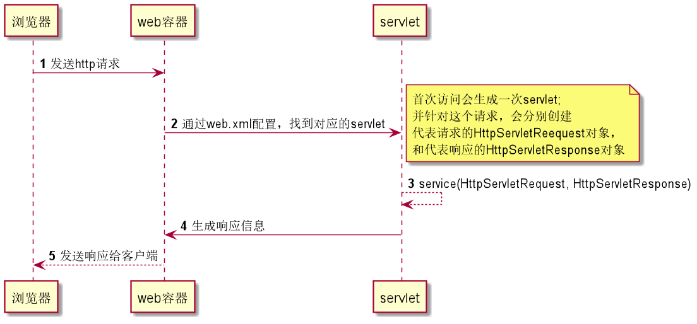
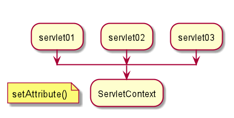
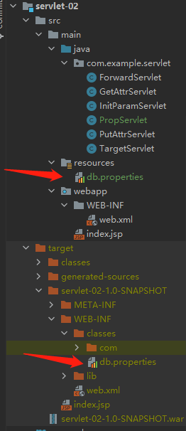

# JavaWeb


## 域对象

**1.什么是域对象**
域对象主要用在web应用中，负责存储数据，通俗的讲就是这个对象本身可以存储一定范围内的所有数据，通过它就能获取和存储数据，
可以理解为万能的一个属性，只要调用它就可以获得这个范围（域）内的想要的数据，也可以修改删除数据，当然也可以给这个域添加数据

**2.域对象分类**
根据 作用域的不同主要分为：

PageContext域
HttpServletRequest域
session域
ServletContext域
从上到下作用域依次增大，可以理解为类似修饰符private 、protected 、默认、public 的等级

**3.域对象通用方法**
getAttribute(String name) 获取对应的数据
getAttributeNames()获取所有的key
removeAttribute(String name) 移除对应的数据
SetAttribute(String name, Object object) 设置数据

参考：https://blog.csdn.net/Guesshat/article/details/107653788

## tomcat

### tomcat日志乱码问题

`tomcat日志编码：cmd内 "cd tomcat根目录" "bin\catalina.bat run" 运行，"chcp 65001"切换cmd为utf8，"chcp 936"切换cmd为gbk，确定tomcat日志编码，一般因为tomcat/conf/logging.properties java.util.logging.ConsoleHandler.encoding = UTF-8已设置为utf8`

【切忌】自己改tomcat的logging.properties 为GBk 会导致调试时get/post参数乱码


### pom.xml 

#### 1、tomcat 9 模板

```xml
<?xml version="1.0" encoding="UTF-8"?>
<web-app xmlns="http://xmlns.jcp.org/xml/ns/javaee"
         xmlns:xsi="http://www.w3.org/2001/XMLSchema-instance"
         xsi:schemaLocation="http://xmlns.jcp.org/xml/ns/javaee
                      http://xmlns.jcp.org/xml/ns/javaee/web-app_4_0.xsd"
         version="4.0"
         metadata-complete="true">

</web-app>
```


## Servlet

### maven

```xml
<dependency>
      <groupId>javax.servlet</groupId>
      <artifactId>servlet-api</artifactId>
      <version>2.5</version>
</dependency>
```


### Servlet原理




### ServletContext

#### 1、共享数据

```java
public class PutAttrServlet extends HttpServlet {
    @Override
    protected void doGet(HttpServletRequest req, HttpServletResponse resp) throws ServletException, IOException {
        ServletContext context = this.getServletContext();
        context.setAttribute("foo", "foo");
        resp.getWriter().println("PutAttr");
    }
}
```

```java

public class GetAttrServlet extends HttpServlet {
    @Override
    protected void doGet(HttpServletRequest req, HttpServletResponse resp) throws ServletException, IOException {
        ServletContext context = this.getServletContext();
        String var = (String)context.getAttribute("foo");
        resp.getWriter().println("GetAttr:" + var);
    }
}
```





#### 2、获取初始化参数

```xml
<!-- web.xml -->
<context-param>
    <param-name>db</param-name>
    <param-value>jdbc://mysql/</param-value>
</context-param>

<servlet>
    <servlet-name>initParam</servlet-name>
    <servlet-class>com.example.servlet.InitParamServlet</servlet-class>
</servlet>
<servlet-mapping>
    <servlet-name>initParam</servlet-name>
    <url-pattern>/initParam</url-pattern>
</servlet-mapping>
```

```java

public class InitParamServlet extends HttpServlet {
    @Override
    protected void doGet(HttpServletRequest req, HttpServletResponse resp) throws ServletException, IOException {
        ServletContext context = this.getServletContext();
        String value = context.getInitParameter("db");
        resp.getWriter().println("InitParam:" + value);
    }
}
```


#### 3、请求转发

* url路径不变
* 状态码不是 **3xx**


#### 4、读取资源文件



servlet-02-1.0-SNAPSHOT 是项目根目录

classes 是类路径，程序中找文件都是基于classpath 的

```java

public class PropServlet extends HttpServlet {
    @Override
    protected void doGet(HttpServletRequest req, HttpServletResponse resp) throws ServletException, IOException {
        ServletContext context = this.getServletContext();
        InputStream is = context.getResourceAsStream("/WEB-INF/classes/db.properties"); // / 表示相对的项目根目录
        Properties prop = new Properties();
        prop.load(is);
        String username = prop.getProperty("username");
        username=new String(username.getBytes("ISO-8859-1"),"gbk"); // TODO 这里遗留一个乱码问题
        System.out.println("username:" + username);
        resp.getWriter().println(username + "=" + prop.getProperty("password"));
    }
}
```

**注意**，properties 中的中文乱码问题，待解决


### HttpServletResponse

response 用来控制浏览器的行为【强大】

#### 常见应用

##### 下载文件


```java

public class DownServlet extends HttpServlet {
    @Override
    protected void doGet(HttpServletRequest req, HttpServletResponse resp) throws ServletException, IOException {
        String path = "D:\\Repos-Study\\JavaWeb\\javaweb-03-servlet\\response\\src\\main\\resources\\企微会话存档购买订单截图.png";
        String fileName = path.substring(path.lastIndexOf("\\") + 1);
        System.out.println("fileName=" + fileName);
        FileInputStream fis = new FileInputStream(path);
        resp.setHeader("Content-Disposition", "attachment;filename="+ URLEncoder.encode(fileName, "utf-8"));
        byte[] buffer = new byte[1024];
        OutputStream os = resp.getOutputStream();
        while ( fis.read(buffer) > 0 ) {
            os.write(buffer);
        }
        fis.close();
        os.close();
    }
}
```

##### 验证码功能

略

##### 实现重定向


**重定向原理**

```java
resp.setHeader("Location", "/xx")
resp.setStatus(302);
```

**面试题：重定向与转发的区别**

相同点：都会进行页面跳转

不同点：

* 请求转发，url 不会产生变化 307
* 重定向，url 会产生变化 302


**常见场景**

用户登录

### HttpServletRequest

#### 常见应用

获取请求参数

请求转发

## Cookie

cookie 默认浏览器关掉后，cookie会清空。需要显示设置 setAge()，但浏览器关闭后，若cookie还存在，会不安全。


### cookie的上限

* 300个cookie浏览器上限
* 一个web站点最多存放20个cookie
* cookie大小限制4kb

### 删除cookie

* 不设置有效期，关闭浏览器自动失效
* 设置有效期为 0


## Session（重点）

* 服务器会给每个用户（浏览器）创建一个session对象
* 用户登录后整个


 
