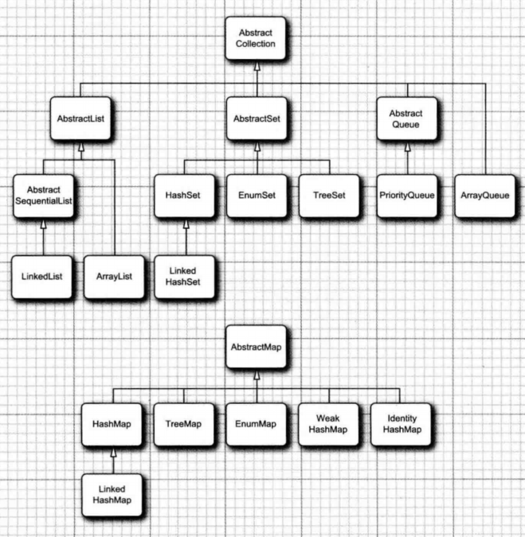
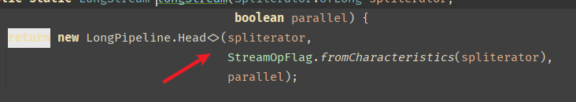
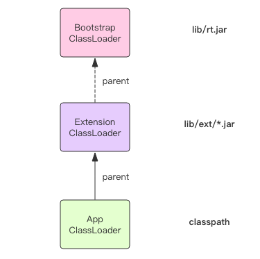
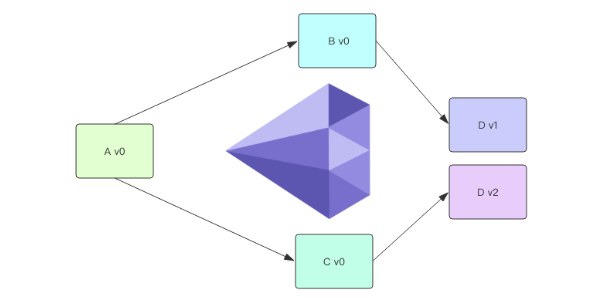

*书山有路勤为径，学海无涯苦作舟*


# 数据类型


TODO ByteBuffer 与 byte[] 区别


## 引用类型

> 四种类型：强软弱虚

- 强引用。直接`new`
- 软引用。通过`SoftReference`创建，在内存空间不足的时候直接销毁，即它可能最后的销毁地点是在老年区
- 弱引用。通过`WeakReference`创建，在`GC`的时候直接销毁。即其销毁地点必定为伊甸区
- 虚引用。通过`PhantomReference`创建，它和不存也一样，**「非常虚，只能通过引用队列在进行一些操作，主要用于堆外内存回收」**


### 强引用

谈到引用就就必须要谈到 GC。

我们在堆中创建对象，GC 回收没有引用指向的对象，这里的引用是指强引用（注意现在要认识到引用有四种类型）。对象被回收时，会执行对象的 finalize 方法（JDK8 后的版本中已被 deprecated）


```java
public class Test {
    public static void main(String[] args) throws IOException {
        A a = new A();
        a = null;
        System.gc(); // 仅是提醒虚拟机，希望进行一次垃圾回收
        System.out.println(a);
        System.in.read(); // 阻塞main线程，给gc释放的时间
    }
}

class A {
    @Override
    protected void finalize() throws Throwable {
        super.finalize();
        System.out.println("finalize");
    }
}

/** 执行结果：
null
finalize
*/
```


上述程序

- gc 是单独的线程，所以打印的顺序不能保证
- 执行System.gc()函数的作用只是提醒或告诉虚拟机，希望进行一次垃圾回收。
    至于什么时候进行回收还是取决于虚拟机，而且也不能保证一定进行回收（如果-XX:+DisableExplicitGC设置成true，则不会进行回收）。


### 软引用

Soft Reference

```java
public class Test_SoftReference {
    public static void main(String[] args) throws InterruptedException {
        SoftReference m = new SoftReference<>(new byte[1024 * 1024 * 10]);
        System.out.println(m.get());
        System.gc();
//        TimeUnit.SECONDS.sleep(5);
//        System.out.println(m.get());

        byte[] b = new byte[1024 * 1024 * 12];
        System.out.println(m.get());
    }
}
```


设置 heap 空间为 20M，VM options `-Xmx20M`，执行结果为

```java
[B@4554617c[B@4554617cnull
```


程序解读 heap 空间20M，软引用指向的字节数组占了 10M，当再创建12M的空间时，内存不够，所以GC 会把软引用干掉。


> 应用场景

适合缓存使用

*一些看起来冷门的知识是一些性能框架的基础*


### 弱引用

```java
public class Test03_WeakReference {
    public static void main(String[] args) throws InterruptedException {
        WeakReference m = new WeakReference<>(new byte[1024]);
        System.out.println(m.get());
        System.gc();
        TimeUnit.SECONDS.sleep(2);
        System.out.println(m.get());
    }
}
/** 执行结果：
[B@4554617c
null
*/
```


> 应用场景

用在ThreadLocal 的实现上。

在以往我们使用完对象以后等着`GC`清理，但是对于`ThreadLocal`来说，即使我们使用结束，也会因为线程本身存在该对象的引用，处于对象可达状态，垃圾回收器无法回收。这个时候当`ThreadLocal`太多的时候就会出现内存泄漏的问题。

而我们将`ThreadLocal`对象的引用作为弱引用，那么就很好的解决了这个问题。当我们自己使用完`ThreadLocal`以后，**「当**`**GC**`**的时候就会将我们创建的强引用直接干掉，而这个时候我们完全可以将线程**`**Map**`**中的引用干掉，于是使用了弱引用」**


### 虚引用

```java
public class Test04_PhantomReference {
    private static final List<Object> LIST = new LinkedList<>();
    private static final ReferenceQueue<M> QUEUE = new ReferenceQueue();

    public static void main(String[] args) throws InterruptedException {
        PhantomReference<M> m = new PhantomReference<>(new M(), QUEUE);
        System.out.println(m.get());
        // 分配到 JVM 内存空间
        ByteBuffer b = ByteBuffer.allocate(1024);
        // 直接分配到 OS 内存空间，也叫直接内存
        //ByteBuffer b = ByteBuffer.allocateDirect(1024);
        new Thread(()->{
            while (true) {
                LIST.add(new byte[1024 * 1024]);
                try {
                    TimeUnit.SECONDS.sleep(1);
                } catch (InterruptedException e) {
                    e.printStackTrace();
                }
                System.out.println(m.get());
            }
        }).start();
        new Thread(()->{
            while (true) {
                Reference<? extends  M> poll = QUEUE.poll();
                if (poll != null) {
                    System.out.println("--- 虚引用对象被 jvm 回收了--- " + poll);
                }
            }
        }).start();

        TimeUnit.SECONDS.sleep(1);
    }
}
```


> 场景

NIO 的管理直接内存

先了解下网络编程：ByteBuffer 一般用于网络编程，网卡将接收到的数据先放到 OS 中，然后 OS 会拷贝到 JVM 中，这种拷贝很频繁，在 JDK 1.5 后，提出了直接内存，省去了拷贝。具体参考 NIO 的 zero copy 零拷贝。现在的网络框架使用的都是直接内存。

```java
// 分配到 JVM 内存空间，堆内存
ByteBuffer b = ByteBuffer.allocate(1024);
// 直接分配到 OS 内存空间，也叫直接内存（JVM堆外内存）
ByteBuffer b = ByteBuffer.allocateDirect(1024);
```


虚引用（看源码）指向了直接内存，并将对象的状态维护在事件队列中

- 对象 finalize 时，将信息维护在事件队列中？？

GC 是 C++ 程序，可以管理内存。正常的只管理 JVM 中的内存，当发现有虚引用事件队列时，会开启另外的线程去管理操作系统的内存，即直接内存。


# 关键字

## instanceof


# 枚举

特点

* 安全 —— 反射不能调用其构造方法，适用于 单例 场景


示例

```java
enum Color 
{ 
    RED, GREEN, BLUE; 
}
```


# 集合


​	


## Queue 接口

AbstractQueue 抽象类：为类库实现者设计，要比直接实现 Queue 会方便许多

底层支持数组和链表两种数据结构

|        | 数组 | 链表 |
| ------ | ---- | ---- |
| 容量   | 有界 | 无界 |
| 效率？ | 高   |      |
|        |      |      |


## Collection接口

Collection 是 Queue 的父接口


## Iterator接口

Collection 中包含 Iterator 接口

```java
public static void main(String[] args) {
    List<String> list = Arrays.asList("h","e","e","e","e");
    list.iterator().forEachRemaining(item->{
        System.out.println(item);
    });
}
```


## List 接口

List 是一个有序集合。元 素会增加到容器中的特定位置。可以采用两种方式访问元素：使用迭代器访问， 或者使用一个整数索引来访问。后一种方法称为随机访问（ random access), 因为这样可以按任意顺序访问元素。与之不同， 使用迭代器访问时，必须顺序地访问元素。


	


### HashTable

散列表是一种数据结构，用于快速地查找所需要的对象，由链表数组实现。


	


### hashCode 和 equals

若重写了 equals 方法，则必须重写hashCode。避免语义不一致。在 Set 和 Map 中都依赖 hashcode 和 equals 判断是否为相同的对象和key。


## Map 接口

遍历：

JDK 8 后，推荐使用  Map.foreach ；低版本建议用 entrySet，其中 keySet 内部遍历了2次有性能问题


	


### HashMap

数据结构：数组 + 红黑树（早期是链表）

时间复杂度 O(1) ——why ？

> HashMap 在工作中怎么用

HashMap 的构造函数中有两个参数，加载因子（0.75） 和 初始容量（16）

（TODO）看下狂神的博客


> 减少碰撞


> 说说你对红黑树的见解？


### WeakHashMap

map 的key 是弱引用，且有队列维护，将失效 key 的 entries 自动移除。

使用时把 key 置空

一般用于中间件的开发中。


### HashSet

> HashSet 的实现原理

```java
public HashSet() {
    map = new HashMap<>();
}
```


### Comparator

场景：

- 排序
- 分组


### 遍历

特征

- 有序性(sort)：有序性是指遍历的结果是按某种比较规则依次排列的
- 稳定性(order)  ：稳定性指集合每次遍历的元素次序是一定的

|           | order | sort |
| --------- | ----- | ---- |
| ArrayList | 是    | 否   |
| HashMap   | 否    | 否   |
| TreeSet   | 是    | 是   |

# 泛型

Generics

特点

* 仅适用于编译阶段 for  javac
* 类型安全 —— 数据的安全性？免去强制类型转换？？
* 规范集合的元素
* 提高代码的可读性


> 类型擦除

泛型在编译器有效，在运行期被删除，也就是说所有的泛型参数类型在编译后都会被清除掉。

在编译后所有的泛型类型都会做相应的转化。转换规则如下：

* List<String>、List<Integer>、List<T> 擦出后的类型为 List。
* List<String>[] 擦除后的类型为 List[]。
* List<? extends E>、List<? super E> 擦出后的类型为 List<E>。
* List<T extends Serializable & Cloneable> 擦出后为 List<Serializable>。


> 那反射操作泛型的场景是什么？？


> 泛型可以省略吗

	


调用泛型方法，通常参数可以推断，不需要加；此外，因为类型擦除的缘故，编译器可以简单地把所有参数都推断为 Object。

定义泛型类的实例，不加应该是默认 Object，但我不确定。由于类型擦除的缘故，下面这个是正确的：

G g = new G();

说到底，这个问题并不重要，因为 Java 的泛型参数是擦除的。如果你不确定，可以选择加或者不加，然后尝试编译，或者看 IDE 提示。

写List和Map时，我们习惯这样写：

List notssourlList1 = new ArrayList<>();

在我本地跑没有问题（本地jdk1.8），但是到了测试那边，居然在服务器启动时，直接报错，连编译都没过

最后发现，jdk6是不支持泛型的省略的，要1.8以上的版本才ok


> 泛型擦除


## 通配符

T，E，K，V，？

约定俗成的用法

- ？ 表示不确定的 java 类型
- T (type) 表示具体的一个java类型
- K V (key value) 分别代表java键值中的Key Value
- E (element) 代表Element


## ？无界通配符

先看例子：

我有一个父类 Animal 和几个子类，如狗、猫等，现在我需要一个动物的列表，我的第一个想法是像这样的：

```java
List<Animal> listAnimals
```


但是老板的想法确实这样的：

```java
List<? extends Animal> listAnimals
```


为什么要使用通配符而不是简单的泛型呢？通配符其实在声明局部变量时是没有什么意义的，但是当你为一个方法声明一个参数时，它是非常重要的。

```java
static int countLegs (List<? extends Animal > animals ) {
    int retVal = 0;
    for ( Animal animal : animals )
    {
        retVal += animal.countLegs();
    }
    return retVal;
}

static int countLegs1 (List< Animal > animals ){
    int retVal = 0;
    for ( Animal animal : animals )
    {
        retVal += animal.countLegs();
    }
    return retVal;
}

public static void main(String[] args) {
    List<Dog> dogs = new ArrayList<>();
    // 不会报错
    countLegs( dogs );
    // 报错
    countLegs1(dogs);
}
```


对于不确定或者不关心实际要操作的类型，可以使用无限通配符（尖括号里一个问号，即 <?> ）


## 上限通配符 <? extend E>

限定了父类及其子类

好处是

- 编译安全性，如果传入的类型不是 E 或者 E 的子类，编译不成功
- （与简单泛型比较）方法通用性，避免了 E 子类要使用得先强转成 E 的麻烦


## 下限通配符 <? super E>

用 super 进行声明，表示参数化的类型可能是所指定的类型，或者是此类型的父类型，直至 Object

```java
private <T> void test(List<? super T> dst, List<T> src){
    for (T t : src) {
        dst.add(t);
    }
}

public static void main(String[] args) {
    List<Dog> dogs = new ArrayList<>();
    List<Animal> animals = new ArrayList<>();
    new Test3().test(animals,dogs);
}
// Dog 是 Animal 的子类
class Dog extends Animal {

}
```


## ？ 和 T 的区别

T 是一个 确定的 类型，通常用于泛型类和泛型方法的定义，？是一个 不确定 的类型，通常用于泛型方法的调用代码和形参，不能用于定义类和泛型方法。

区别

- 通过 类型参数（T）来确保泛型参数的一致性
- 类型参数（T）可以多重限定而通配符不行

```java
<T extends InterfaceA & InterfaceB>
```

- 通配符（？）可以使用超类限定而类型参数（T）不行

```java
// 类型参数T
T extends A

// 通配符？
? extends A
? super A
```


## Class< T >

```java
// 通过反射的方式生成  multiLimit 
// 对象，这里比较明显的是，我们需要使用强制类型转换
MultiLimit multiLimit = (MultiLimit)Class.forName("com.glmapper.bridge.boot.generic.MultiLimit").newInstance();
```

对于上述代码，在运行期，如果反射的类型不是 MultiLimit 类，那么一定会报 java.lang.ClassCastException 错误。

对于这种情况，则可以使用下面的代码来代替，使得在在编译期就能直接 检查到类型的问题：

```java
public class Test01 {
    public static void main(String[] args) throws InstantiationException, IllegalAccessException {
        A a = createInstance(A.class);
        B b = createInstance(B.class);
    }
    
    public static <T> T createInstance(Class<T> clazz) throws IllegalAccessException, InstantiationException {
        return clazz.newInstance();
    }
}

class A{}
class B{}
```


## Class< T > 和 Class< ? > 区别

`Class<T>` 在实例化的时候，T 要替换成具体类。`Class<?>` 它是个通配泛型，? 可以代表任何类型，所以主要用于声明时的限制情况。比如，我们可以这样做申明：

```java
// 可以
public Class<?> clazz;
// 不可以，因为 T 需要指定类型(让当前的类也指定 T 才行)
public Class<T> clazzT;
```


## PECS法则

PECS法则：生产者（Producer）使用extends，消费者（Consumer）使用super

"PECS" is from the collection's point of view. If you are *only* pulling items from a generic collection, it is a producer and you should use `extends`; if you are *only* stuffing items in, it is a consumer and you should use `super`. If you do both with the same collection, you shouldn't use either `extends` or `super`.


> 为什么要引入泛型通配符？

为了保证类型安全


# 对象与类

## 匿名类

Java 中可以实现一个类中包含另外一个类，且不需要提供任何的类名直接实例化。

主要是用于在我们需要的时候创建一个对象来执行特定的任务，可以使代码更加简洁。

匿名类是不能有名字的类，它们不能被引用，只能在创建时用 **new** 语句来声明它们。

特点：

- 匿名类语法格式：


```java
class outerClass {
    // 定义一个匿名类
    object1 = new Type(parameterList) {
         // 匿名类代码
    };
}
```


## 实现接口

接口可以 new，不直接写实现类，这种叫做匿名实现类。例子：

> 应用场景

- 线程开发，new Thread 会传入 Runnable 对象，已知 Runnable 是接口，且只有一个 run 方法，出于代码的优雅，我们使用匿名类的语法，直接 new Runnable，然后在代码块里实现 run 方法即可


```java
new Thread(new Runnable(){
    @Override
    public void run() {
        
    }
}).start();
```

## default

使用场景

- switch 语句
- 定义接口时，用 default 修饰方法（JDK 1.8）


> JDK8中为了加强接口的能力，使得接口可以存在具体的方法，前提是方法需要被default或static关键字所修饰。这样做的好处是接口的每个实现类如果都想要相同的功能，就不需要重复代码，而是在接口进行定义即可。默认方法在子类也可以被重写

- 定义类时，默认修饰符

| 位置           | private | default（默认） | protected | public |
| -------------- | ------- | --------------- | --------- | ------ |
| 同一个类       | 是      | 是              | 是        | 是     |
| 同一个包的类   | 否      | 是              | 是        | 是     |
| 不同包内的子类 | 否      | 否              | 是        | 是     |
| 不同包的不同类 | 否      | 否              | 否        | 是     |


## 面向对象

> 什么是继承和封装


## 内部类


## static 类型

1. static变量
2. static方法
3. static代码块
4. static内部类
5. static包内导入


static修饰的变量、方法、代码块、内部类在类加载期间就已经完成初始化，存储在Java Heap（JDK7.0之前存储在方法区）中静态存储区，因此static优于对象而存在。

static修饰的成员（变量、方法）被所有对象所共享，也叫静态变量或静态方法，可直接通过类调用（也建议通过类调用）。


> static 的滥用场景

静态代码块常用的有三种

- 构造代码块（初始化块）在类中方法外出现

- 作为构造代码块，多个构造方法中相同的代码存放到一起，每次调用构造都执行，并且在构造方法前执行给类进行初始化 —— 给属性赋值
    - 读取配置文件信息（mysql驱动），获取当前服务器参数
    - 如果有一段代码从始至终，只运行一次，可以写到静态代码块

- 局部代码块：在方法中出现，限定变量生命周期，及早释放，提高内存利用率


**静态内部类与非静态内部类有何异同？**

| 静态内部类                                         | 非静态内部类                                 |
| -------------------------------------------------- | -------------------------------------------- |
| 不需要有指向外部类的引用                           | 必须通过外部类的new关键字引用                |
| 可定义普通变量和方法，也可定义静态变量和方法       | 可定义普通变量和方法，不可定义静态变量和方法 |
| 可以调用外部类的静态成员，不能调用外部类的普通成员 | 可调用外部类的普通成员和静态成员             |


# 类对象

*参考 java-demo 的 com.xxx.expert.clazz*


## 类加载的执行过程

* 加载（类）
    * 加载到内存生成类对象 - ClassLoader 将字节码生成 Class 对象
* 链接（类）
    * 验证
    * 准备：静态变量
    * 解析：常量
* 初始化（类）
    * clinit 合并静态赋值语句
    * 有父类，则先初始化父类


## 加载类的方式

主动引用

* Class.forName('完成类名:包路径+类名') 
    * 应用场景：传参构造，更加灵活
* 访问静态变量


被动引用（不会初始化类？）

* 访问父类的静态变量
* 访问常量


## ClassLoader


### 双亲委派

应用场景：为了安全性，防止系统类被用户重写。


---------


参考：https://blog.csdn.net/briblue/article/details/54973413


> ClassLoader 的作用

它是用来加载 Class 的。它负责将 Class 的字节码形式转换成内存形式的 Class 对象。字节码可以来自于磁盘文件 *.class，也可以是 jar 包里的* .class，也可以来自远程服务器提供的字节流，字节码的本质就是一个字节数组 []byte，它有特定的复杂的内部格式。


	


有很多字节码加密技术就是依靠定制 ClassLoader 来实现的。先使用工具对字节码文件进行加密，运行时使用定制的 ClassLoader 先解密文件内容再加载这些解密后的字节码。


每个 Class 对象的内部都有一个 classLoader 字段来标识自己是由哪个 ClassLoader 加载的。ClassLoader 就像一个容器，里面装了很多已经加载的 Class 对象。


```java
// class 知道自己是由哪个 classLoader 加载的
JdbcUtils.class.getClassLoader();
```


```java
class Class<T> {
  ...
  private final ClassLoader classLoader;
  ...
}
```


> 延迟加载

JVM 运行并不是一次性加载所需要的全部类的，它是按需加载，也就是延迟加载。程序在运行的过程中会逐渐遇到很多不认识的新类，这时候就会调用 ClassLoader 来加载这些类。加载完成后就会将 Class 对象存在 ClassLoader 里面，下次就不需要重新加载了。

比如你在调用某个类的静态方法时，首先这个类肯定是需要被加载的，但是并不会触及这个类的实例字段，那么实例字段的类别 Class 就可以暂时不必去加载，但是它可能会加载静态字段相关的类别，因为静态方法会访问静态字段。而实例字段的类别需要等到你实例化对象的时候才可能会加载。


#### 环境变量

了解了.class文件后，我们再来思考下，我们自己编写的各种类是如何被加载到jvm(java虚拟机)中去的。

Window平台上的环境变量，主要有3个：JAVA_HOME、PATH、CLASSPATH

> classPath

```java
CLASSPATH=.;%JAVA_HOME%\lib;%JAVA_HOME%\lib\tools.jar
```


指向jar包路径（以分号分割），需要注意最前面的 `.`表示当前目录


#### 类加载流程

ClassLoader 类型

- BootstrapClassLoader
- ExtensionClassLoader
- AppClassLoader
- URLClassLoader
- 自定义加载器


JVM 运行实例中会存在多个 ClassLoader，不同的 ClassLoader 会从不同的地方加载字节码文件。它可以从不同的文件目录加载，也可以从不同的 jar 文件中加载，也可以从网络上不同的服务地址来加载。


JVM 中内置了三个重要的 ClassLoader，分别是 BootstrapClassLoader、ExtensionClassLoader 和 AppClassLoader。


- **BootstrapClassLoader** 负责加载 JVM 运行时核心类，这些类位于 JAVA_HOME/lib/rt.jar 文件中，我们常用内置库 java.xxx. *都在里面，比如 java.util.*、java.io.*、java.nio.*、java.lang.* 等等。这个 ClassLoader 比较特殊，它是由 C 代码实现的，我们将它称之为「根加载器」。
    另外需要注意的是可以通过启动jvm时指定-Xbootclasspath和路径来改变Bootstrap ClassLoader的加载目录。比如`java -Xbootclasspath/a:path` 被指定的文件追加到默认的bootstrap路径中。
- **ExtensionClassLoader** 负责加载 JVM 扩展类，比如 swing 系列、内置的 js 引擎、xml 解析器 等等，这些库名通常以 javax 开头，它们的 jar 包位于 JAVA_HOME/lib/ext/*.jar 中，有很多 jar 包。
    还可以加载 `-D java.ext.dirs` 选项指定的目录。
    ***AppClassLoader*（也称为**SystemAppClass**） 才是直接面向我们用户的加载器，它会加载 Classpath 环境变量里定义的路径中的 jar 包和目录。我们自己编写的代码以及使用的第三方 jar 包通常都是由它来加载的。


那些位于网络上静态文件服务器提供的 jar 包和 class文件，jdk 内置了一个 URLClassLoader，用户只需要传递规范的网络路径给构造器，就可以使用 URLClassLoader 来加载远程类库了。URLClassLoader 不但可以加载远程类库，还可以加载本地路径的类库，取决于构造器中不同的地址形式。ExtensionClassLoader 和 AppClassLoader 都是 URLClassLoader 的子类，它们都是从本地文件系统里加载类库。


AppClassLoader 可以由 ClassLoader 类提供的静态方法 getSystemClassLoader() 得到，它就是我们所说的「系统类加载器」，我们用户平时编写的类代码通常都是由它加载的。当我们的 main 方法执行的时候，这第一个用户类的加载器就是 AppClassLoader。


**TODO 给出程序示例**


#### ClassLoader 传递性


程序在运行过程中，遇到了一个未知的类，它会选择哪个 ClassLoader 来加载它呢？虚拟机的策略是使用调用者 Class 对象的 ClassLoader 来加载当前未知的类。何为调用者 Class 对象？就是在遇到这个未知的类时，虚拟机肯定正在运行一个方法调用（静态方法或者实例方法），这个方法挂在哪个类上面，那这个类就是调用者 Class 对象。前面我们提到每个 Class 对象里面都有一个 classLoader 属性记录了当前的类是由谁来加载的。

因为 ClassLoader 的传递性，所有延迟加载的类都会由初始调用 main 方法的这个 ClassLoader 全全负责，它就是 AppClassLoader。

前面我们提到AppClassLoader 只负责加载 Classpath 下面的类库，如果遇到没有加载的系统类库怎么办，AppClassLoader 必须将系统类库的加载工作交给 BootstrapClassLoader 和 ExtensionClassLoader 来做，这就是我们常说的「双亲委派」。


	


AppClassLoader 在加载一个未知的类名时，它并不是立即去搜寻 Classpath，它会首先将这个类名称交给 ExtensionClassLoader 来加载，如果 ExtensionClassLoader 可以加载，那么 AppClassLoader 就不用麻烦了。否则它就会搜索 Classpath 。

而 ExtensionClassLoader 在加载一个未知的类名时，它也并不是立即搜寻 ext 路径，它会首先将类名称交给 BootstrapClassLoader 来加载，如果 BootstrapClassLoader 可以加载，那么 ExtensionClassLoader 也就不用麻烦了。否则它就会搜索 ext 路径下的 jar 包。

这三个 ClassLoader 之间形成了级联的父子关系，每个 ClassLoader 都很懒，尽量把工作交给父亲做，父亲干不了了自己才会干。每个 ClassLoader 对象内部都会有一个 parent 属性指向它的父加载器。


```java
class ClassLoader {
  ...
  private final ClassLoader parent;
  ...
}
```


值得注意的是图中的 ExtensionClassLoader 的 parent 指针画了虚线，这是因为它的 parent 的值是 null，当 parent 字段是 null 时就表示它的父加载器是「根加载器」。如果某个 Class 对象的 classLoader 属性值是 null，那么就表示这个类也是「根加载器」加载的。


#### Class.forName

当我们在使用 jdbc 驱动时，经常会使用 Class.forName 方法来动态加载驱动类。

```java
Class.forName("com.mysql.cj.jdbc.Driver");
```

其原理是 mysql 驱动的 Driver 类里有一个静态代码块，它会在 Driver 类被加载的时候执行。这个静态代码块会将 mysql 驱动实例注册到全局的 jdbc 驱动管理器里。

```java
class Driver {
  static {
    try {
       java.sql.DriverManager.registerDriver(new Driver());
    } catch (SQLException E) {
       throw new RuntimeException("Can't register driver!");
    }
  }
  ...
}
```


forName 方法同样也是使用调用者 Class 对象的 ClassLoader 来加载目标类。不过 forName 还提供了多参数版本，可以指定使用哪个 ClassLoader 来加载

```java
Class<?> forName(String name, boolean initialize, ClassLoader cl)
```

通过这种形式的 forName 方法可以突破内置加载器的限制，通过使用自定类加载器允许我们自由加载其它任意来源的类库。根据 ClassLoader 的传递性，目标类库传递引用到的其它类库也将会使用自定义加载器加载。


#### 自定义加载器

ClassLoader 里面有三个重要的方法 loadClass()、findClass() 和 defineClass()。

loadClass() 方法是加载目标类的入口，它首先会查找当前 ClassLoader 以及它的双亲里面是否已经加载了目标类，如果没有找到就会让双亲尝试加载，如果双亲都加载不了，就会调用 findClass() 让自定义加载器自己来加载目标类。ClassLoader 的 findClass() 方法是需要子类来覆盖的，不同的加载器将使用不同的逻辑来获取目标类的字节码。拿到这个字节码之后再调用 defineClass() 方法将字节码转换成 Class 对象。下面我使用伪代码表示一下基本过程


```java
class ClassLoader {

  // 加载入口，定义了双亲委派规则
  Class loadClass(String name) {
    // 是否已经加载了
    Class t = this.findFromLoaded(name);
    if(t == null) {
      // 交给双亲
      t = this.parent.loadClass(name)
    }
    if(t == null) {
      // 双亲都不行，只能靠自己了
      t = this.findClass(name);
    }
    return t;
  }

  // 交给子类自己去实现
  Class findClass(String name) {
    throw ClassNotFoundException();
  }

  // 组装Class对象
  Class defineClass(byte[] code, String name) {
    return buildClassFromCode(code, name);
  }
}

class CustomClassLoader extends ClassLoader {

  Class findClass(String name) {
    // 寻找字节码
    byte[] code = findCodeFromSomewhere(name);
    // 组装Class对象
    return this.defineClass(code, name);
  }
}
```


自定义类加载器不易破坏双亲委派规则，不要轻易覆盖 loadClass 方法。否则可能会导致自定义加载器无法加载内置的核心类库。在使用自定义加载器时，要明确好它的父加载器是谁，将父加载器通过子类的构造器传入。如果父类加载器是 null，那就表示父加载器是「根加载器」。

```java
// ClassLoader 构造器
protected ClassLoader(String name, ClassLoader parent);
```

双亲委派规则可能会变成三亲委派，四亲委派，取决于你使用的父加载器是谁，它会一直递归委派到根加载器。


#### **Class.forName vs ClassLoader.loadClass**


这两个方法都可以用来加载目标类，它们之间有一个小小的区别，那就是 Class.forName() 方法可以获取原生类型的 Class，而 ClassLoader.loadClass() 则会报错。


```java
Class<?> x = Class.forName("[I");
System.out.println(x);

x = ClassLoader.getSystemClassLoader().loadClass("[I");
System.out.println(x);

---------------------
class [I

Exception in thread "main" java.lang.ClassNotFoundException: [I
...
```


#### 钻石依赖


项目管理上有一个著名的概念叫着「钻石依赖」，是指软件依赖导致同一个软件包的两个版本需要共存而不能冲突。


	


我们平时使用的 maven 是这样解决钻石依赖的，它会从多个冲突的版本中选择一个来使用，如果不同的版本之间兼容性很糟糕，那么程序将无法正常编译运行。Maven 这种形式叫「扁平化」依赖管理。


使用 ClassLoader 可以解决钻石依赖问题。不同版本的软件包使用不同的 ClassLoader 来加载，**位于不同 ClassLoader 中名称一样的类实际上是不同的类**。下面让我们使用 URLClassLoader 来尝试一个简单的例子，它默认的父加载器是 AppClassLoader


```java
public class Dep {
    public void print() {
        System.out.println("v1");
    }
}

public class Dep {
    public void print() {
        System.out.println("v2");
    }
}

public class Test {
    public static void main(String[] args) throws Exception {
        String v1dir = "file:///Users/qianwp/source/jcl/v1/";
        String v2dir = "file:///Users/qianwp/source/jcl/v2/";
        URLClassLoader v1 = new URLClassLoader(new URL[]{new URL(v1dir)});
        URLClassLoader v2 = new URLClassLoader(new URL[]{new URL(v2dir)});

        Class<?> depv1Class = v1.loadClass("Dep");
        Object depv1 = depv1Class.getConstructor().newInstance();
        depv1Class.getMethod("print").invoke(depv1);

        Class<?> depv2Class = v2.loadClass("Dep");
        Object depv2 = depv2Class.getConstructor().newInstance();
        depv2Class.getMethod("print").invoke(depv2);

        System.out.println(depv1Class.equals(depv2Class));
   }
}
```


在运行之前，我们需要对依赖的类库进行编译


```shell
$ cd ~/source/jcl/v1
$ javac Dep.java
$ cd ~/source/jcl/v2
$ javac Dep.java
$ cd ~/source/jcl
$ javac Test.java
$ java Test
v1
v2
false
```


在这个例子中如果两个 URLClassLoader 指向的路径是一样的，下面这个表达式还是 false，因为即使是同样的字节码用不同的 ClassLoader 加载出来的类都不能算同一个类


```java
depv1Class.equals(depv2Class)
```


我们还可以让两个不同版本的 Dep 类实现同一个接口，这样可以避免使用反射的方式来调用 Dep 类里面的方法。


```java
Class<?> depv1Class = v1.loadClass("Dep");
IPrint depv1 = (IPrint)depv1Class.getConstructor().newInstance();
depv1.print()
```


ClassLoader 固然可以解决依赖冲突问题，不过它也限制了不同软件包的操作界面必须使用反射或接口的方式进行动态调用。Maven 没有这种限制，它依赖于虚拟机的默认懒惰加载策略，运行过程中如果没有显示使用定制的 ClassLoader，那么从头到尾都是在使用 AppClassLoader，而不同版本的同名类必须使用不同的 ClassLoader 加载，所以 Maven 不能完美解决钻石依赖。

如果你想知道有没有开源的包管理工具可以解决钻石依赖的，我推荐你了解一下 sofa-ark，它是蚂蚁金服开源的轻量级类隔离框架。


#### 分工与合作

这里我们重新理解一下 ClassLoader 的意义，它相当于类的命名空间，起到了类隔离的作用。位于同一个 ClassLoader 里面的类名是唯一的，不同的 ClassLoader 可以持有同名的类。ClassLoader 是类名称的容器，是类的沙箱。


		


不同的 ClassLoader 之间也会有合作，它们之间的合作是通过 parent 属性和双亲委派机制来完成的。parent 具有更高的加载优先级。除此之外，parent 还表达了一种共享关系，当多个子 ClassLoader 共享同一个 parent 时，那么这个 parent 里面包含的类可以认为是所有子 ClassLoader 共享的。这也是为什么 BootstrapClassLoader 被所有的类加载器视为祖先加载器，JVM 核心类库自然应该被共享。


#### Thread.contextClassLoader


如果你稍微阅读过 Thread 的源代码，你会在它的实例字段中发现有一个字段非常特别


```java
class Thread {
  ...
  private ClassLoader contextClassLoader;

  public ClassLoader getContextClassLoader() {
    return contextClassLoader;
  }

  public void setContextClassLoader(ClassLoader cl) {
    this.contextClassLoader = cl;
  }
  ...
}
```


contextClassLoader「线程上下文类加载器」，这究竟是什么东西？

首先 contextClassLoader 是那种需要显示使用的类加载器，如果你没有显示使用它，也就永远不会在任何地方用到它。你可以使用下面这种方式来显示使用它


```java
Thread.currentThread().getContextClassLoader().loadClass(name);
```

这意味着如果你使用 forName(string name) 方法加载目标类，它不会自动使用 contextClassLoader。那些因为代码上的依赖关系而懒惰加载的类也不会自动使用 contextClassLoader来加载。

其次线程的 contextClassLoader 是从父线程那里继承过来的，所谓父线程就是创建了当前线程的线程。程序启动时的 main 线程的 contextClassLoader 就是 AppClassLoader。这意味着如果没有人工去设置，那么所有的线程的 contextClassLoader 都是 AppClassLoader。

那这个 contextClassLoader 究竟是做什么用的？我们要使用前面提到了类加载器分工与合作的原理来解释它的用途。

它可以做到跨线程共享类，只要它们共享同一个 contextClassLoader。父子线程之间会自动传递 contextClassLoader，所以共享起来将是自动化的。

如果不同的线程使用不同的 contextClassLoader，那么不同的线程使用的类就可以隔离开来。

如果我们对业务进行划分，不同的业务使用不同的线程池，线程池内部共享同一个 contextClassLoader，线程池之间使用不同的 contextClassLoader，就可以很好的起到隔离保护的作用，避免类版本冲突。

如果我们不去定制 contextClassLoader，那么所有的线程将会默认使用 AppClassLoader，所有的类都将会是共享的。

线程的 contextClassLoader 使用场合比较罕见，如果上面的逻辑晦涩难懂也不必过于计较。

JDK9 增加了模块功能之后对类加载器的结构设计做了一定程度的修改，不过类加载器的原理还是类似的，作为类的容器，它起到类隔离的作用，同时还需要依靠双亲委派机制来建立不同的类加载器之间的合作关系。


# 接口

接口中可以写静态方法？应用场景是？


# 注解

*参考 java-demo，com.xxx.expert.annotion*


# 反射

*依赖注解、Class对象、ClassLoader的知识*

 

> 基础类型对应表

| Class         | Output                  |
| ------------- | ----------------------- |
| Integer.TYPE  | int                     |
| Integer.class | class java.lang.Integer |
|               |                         |

遇到过如下错误

```java
Exception in thread "main" java.lang.NoSuchMethodException: com.xxx.expert.reflect.User.<init>(java.lang.Integer, java.lang.String, java.lang.Integer)
```

错误原因是反射类型不匹配，找不到对应的方法。Integer.TYPE 与 Integer.class 没有匹配正确。


> 安全检查

setAccessible

```java
Exception in thread "main" java.lang.IllegalAccessException: Class com.xxx.expert.reflect.T04_Practice can not access a member of class com.xxx.expert.reflect.User with modifiers "private"
```

错误原因是 private 默认没有访问权限，需要开启 .setAccessible(true);


> 性能对比

setAccessible

.setAccessible(true) 表示关闭安全检测，关闭情况下，执行速度要比默认反射方式快至少 2 倍；比普通执行要慢数百倍！


# Stream

集合、MySQL 本质就是存储东西的；计算都应该交给流来操作！  

流是流水线的流，处理集合的计算

特点：

- 懒惰式：找到即停
- 可优化：没有硬编码


## ForkJoin 并发框架

JDK 1.7

fork 表示拆分，join 表示合并

特点：

- 递归分治：
- 工作密取：在并行计算中，先完成的线程可以从其他线程队列中窃取任务来执行


# IO

|          | InputStream/OutputStream | Reader/Writer |
| -------- | ------------------------ | ------------- |
| 数据类型 | 字节流                   | 字符流        |
| 类类型   | 抽象类                   | 抽象类        |


# 网络

TCP/IP 在 Java 中对应 Socket 类

Socket 底层是 native 方法，是由操作系统实现的

## 序列化

序列化：将对象在内存存中的状态转成字节码，用于数据传输。

反序列化：接收方可以恢复对象状态到内存中。


